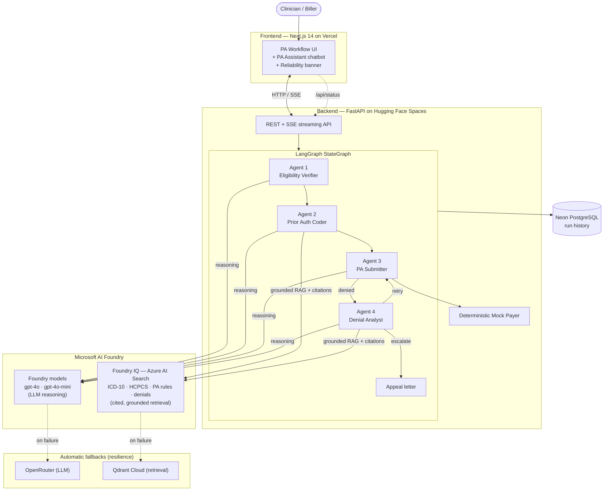

# 🏥 Prior Authorization Automation — Agentic AI

An agentic system that automates the US healthcare **prior authorization (PA)** workflow end-to-end: it verifies patient eligibility, maps the procedure to billing codes, submits the request to a payer, and — when denied — **reasons about the denial, corrects its own submission, and retries**. Every agent decision is shown transparently in a modern Next.js UI with live streaming.

Built with **LangGraph** (multi-agent orchestration), **Microsoft AI Foundry** (LLM reasoning), and **Microsoft Foundry IQ** (agentic, cited knowledge retrieval over ICD-10 / HCPCS / PA rules / denial history), with **Neon** (PostgreSQL) for run persistence. A provider-pluggable layer keeps **OpenRouter** (LLM) and **Qdrant Cloud** (retrieval) as automatic fallbacks for resilience. Frontend deploys to **Vercel**, backend to **Hugging Face Spaces**.

> **Microsoft Agents League — Reasoning Agents track.** This project integrates the **Foundry IQ** intelligence layer for grounded, citation-backed retrieval, satisfying the contest's Microsoft IQ requirement. See [Microsoft IQ Integration](#microsoft-iq-integration).

> **New:** Floating **PA Assistant chatbot** (bottom-right) answers natural-language questions about ICD-10 codes, patients, procedures, PA rules, and run history — powered by Microsoft AI Foundry and grounded in the app's own reference data.

---

## Why this is *agentic*, not just automated

A simple automation stops at a denial. This system runs a **denial → root-cause analysis → correction → resubmit** loop (up to 3 attempts), the same cognitive work a senior billing specialist does manually. The mock payer is **deterministic** (rule-based), so the agent's corrections genuinely resolve denials — its intelligence is demonstrable, not random.

---

## Architecture



```
  Next.js Frontend (frontend/)          FastAPI Backend (api/)
  ─────────────────────────────         ──────────────────────────────
  React + Tailwind + shadcn/ui   HTTP   FastAPI + SSE streaming
  Vercel (free)               ◄──────►  Hugging Face Spaces (Docker, free)
                                                │
                                        LangGraph StateGraph
                                                │
                              ┌─────────────────┼────────────────────┐
                              ▼                 ▼                     ▼
                          Agent 1           Agent 2              Agent 3/4
                          Eligibility  →    Coder       →        Submitter
                          (Model A)         (Model A)            (Model B)
                                                                      │ denied
                                                                      ▼
                                                              Denial Analyst (Model B)
                                                                      │
                                                          retry ◄─────┴──► escalate
```

| Component | Tech |
|---|---|
| Orchestration | LangGraph |
| LLMs (primary) | **Microsoft AI Foundry** — `gpt-4o` (reasoning), `gpt-4o-mini` (fast) |
| LLMs (fallback) | OpenRouter — Model A (fast), Model B (reasoning), free fallback |
| Knowledge retrieval (primary) | **Microsoft Foundry IQ** (Azure AI Search) — cited, grounded RAG |
| Knowledge retrieval (fallback) | Qdrant Cloud |
| Embeddings | sentence-transformers `all-MiniLM-L6-v2` (local, free) |
| Database | Neon (serverless PostgreSQL) |
| Frontend | Next.js 14 + Tailwind CSS + Lucide icons |
| Frontend host | Vercel (free) |
| Backend API | FastAPI + uvicorn (SSE streaming) |
| Backend host | Hugging Face Spaces — Docker (free, 16GB RAM) |
| Mock payer | Deterministic inline Python module |
| PA Assistant chatbot | Foundry fast model + context from all reference data & run history |

### The 4 Agents

1. **Eligibility Verifier** (Model A) — parses the patient FHIR bundle, confirms active coverage, decides whether PA is required. Early-exits on *patient not found*, *inactive coverage*, or *no PA required*.
2. **Prior Auth Coder** (fast Foundry model + Foundry IQ RAG) — maps the plain-English procedure to a CPT/HCPCS code and selects supporting ICD-10 diagnoses, avoiding vague symptom codes; cites the retrieved sources.
3. **PA Submitter** (Foundry reasoning model) — assembles the request and submits to the deterministic mock payer.
4. **Denial Analyst** (Foundry reasoning model + Foundry IQ RAG over denial history) — diagnoses the denial root cause, corrects the coding and retries, or generates an appeal letter and escalates; cites the precedent denials it relied on.

---

## Microsoft IQ Integration

This project integrates **Foundry IQ**, Microsoft AI Foundry's agentic knowledge-retrieval layer, to ground every coding and denial-analysis decision in cited source data and reduce hallucination:

- **Coder agent** retrieves candidate CPT/HCPCS and ICD-10 codes from a Foundry IQ knowledge base (Azure AI Search) and records the **grounded sources** that justified the selection.
- **Denial Analyst agent** retrieves similar resolved denials from the same layer, citing the precedent that informed its correction.
- Each agent step surfaces a **"Grounded sources"** panel in the UI, making the reasoning auditable — directly supporting the Reliability & Safety criterion.

The layer is selected at runtime via two env switches, so the system degrades gracefully to OpenRouter + Qdrant if Azure is unavailable:

| Switch | `foundry` / `foundry_iq` (primary) | Fallback |
|---|---|---|
| `LLM_PROVIDER` | Microsoft AI Foundry | `openrouter` |
| `RETRIEVAL_PROVIDER` | `foundry_iq` (Azure AI Search) | `qdrant` |

---

## Reliability & Accessibility

- **Transparent degradation** — every automatic fallback (Foundry → OpenRouter, Foundry IQ → Qdrant) is recorded server-side (`utils/runtime_status.py`) and exposed at `GET /api/status`. The UI polls this and shows an accessible **reliability banner** (`role="status"`, `aria-live="polite"`) so users always know when results came from a fallback provider — results stay valid, the system stays online.
- **Graceful retrieval fallback** — `utils/retrieval.py` catches Foundry IQ errors and transparently re-runs the query against Qdrant.
- **Accessibility** — keyboard-focusable agent-trace steps with `aria-expanded`/`aria-label`, visible focus rings, and dismissible status messaging.

---

## UI Features

### PA Assistant Chatbot
A floating chat button (`💬`) in the bottom-right corner opens a conversational assistant that can answer natural-language questions grounded in the app's own data:
- *"What is the ICD code for Amebiasis, unspecified?"* → `A069`
- *"Which patients have inactive coverage?"*
- *"Does MRI of the spine require prior auth?"*
- *"Show me recent PA run outcomes"*

The chatbot calls `POST /api/chat`, which searches ICD-10 codes, loads all patients/procedures/PA rules, fetches the last 50 run history records, and sends everything as context to the **fast Foundry model** (with OpenRouter as automatic fallback). Conversation history (last 6 turns) is maintained for follow-up questions.

### Reference Data Tabs
The left-side Reference panel has 4 tabs — each now includes an always-visible **info banner** explaining the data source and linking to official downloads:

| Tab | Source |
|---|---|
| **Patients** | Synthetic HL7 FHIR R4 bundles — zero PHI ([Synthea™](https://synthea.mitre.org/)) |
| **ICD-10 Codes** | CMS FY2024 official release, 74,044 codes ([CMS download page](https://www.cms.gov/medicare/coding-billing/icd-10-codes)) |
| **HCPCS Codes** | Curated CPT + HCPCS Level II subset ([AMA CPT](https://www.ama-assn.org/practice-management/cpt) · [CMS HCPCS](https://www.cms.gov/medicare/coding-billing/healthcare-common-procedure-system)) |
| **PA Requirements** | Representative commercial payer rules ([AMA Prior Auth](https://www.ama-assn.org/practice-management/prior-authorization)) |

---

## Data Sources

| Data | Source | Status |
|---|---|---|
| ICD-10-CM diagnosis codes | CMS FY2024 official release (`icd10cm_codes_2024.txt`) | **Real** |
| Procedure (CPT/HCPCS) codes | Curated set of real, publicly-known codes (`data/hcpcs_codes/procedures.csv`) | **Real codes**, curated subset |
| Patient records | Synthea-format synthetic FHIR bundles (`data/patients/`) | Synthetic (zero HIPAA risk) |
| PA requirement rules | Modeled on common commercial payer policies (`data/pa_required_codes.json`) | Representative |
| Denial reason codes | X12 CARC standard subset | **Real** standard |
| Denial history (RAG seed) | 30 synthetic resolution cases (`data/seed_denials.json`) | Synthetic |

> **Note:** The `FY24-CMS-1785-F-Code-Descriptions/` folder holds the official CMS ICD-10-CM code descriptions. PA-requirement mappings are modeled (not from that folder) since payer PA policies are proprietary.

---

## API Endpoints

| Method | Path | Description |
|---|---|---|
| `GET` | `/health` | Liveness check |
| `GET` | `/api/patients` | List patients |
| `POST` | `/api/submit` | Run PA workflow, return JSON result |
| `POST` | `/api/submit/stream` | Run PA workflow, SSE stream of agent trace |
| `GET` | `/api/history` | All PA runs from Neon DB |
| `GET` | `/api/analytics` | Aggregated approval/denial stats |
| `GET` | `/api/reference/patients-detail` | Full patient table |
| `GET` | `/api/reference/icd10?q=` | ICD-10 code search (74k codes) |
| `GET` | `/api/reference/procedures` | HCPCS/CPT procedure list |
| `GET` | `/api/reference/pa-rules` | PA requirement ruleset JSON |
| `POST` | `/api/chat` | **Chatbot** — LLM answer grounded in reference data + run history |

---

## Setup (Local)

### 1. Prerequisites
- Python 3.11
- Free accounts: [OpenRouter](https://openrouter.ai), [Qdrant Cloud](https://cloud.qdrant.io), [Neon](https://neon.tech)

### 2. Install
```powershell
py -3.11 -m venv venv
.\venv\Scripts\python.exe -m pip install -r requirements.txt
```

### 3. Configure
Copy `.env.example` to `.env` and fill in your keys:
```
# Provider selection
LLM_PROVIDER=foundry            # "foundry" (Azure) or "openrouter"
RETRIEVAL_PROVIDER=foundry_iq   # "foundry_iq" (Azure AI Search) or "qdrant"

# Microsoft AI Foundry (Azure OpenAI v1)
AZURE_OPENAI_ENDPOINT=https://<resource>.openai.azure.com/openai/v1
AZURE_OPENAI_API_KEY=...
AZURE_MODEL_FAST=gpt-4o-mini    # Foundry deployment name (Agents 1 & 2)
AZURE_MODEL_REASONING=gpt-4o    # Foundry deployment name (Agents 3 & 4)

# Microsoft Foundry IQ (Azure AI Search)
AZURE_SEARCH_ENDPOINT=https://<search-service>.search.windows.net
AZURE_SEARCH_KEY=...

# Fallbacks
OPENROUTER_API_KEY=sk-or-...
OPENROUTER_MODEL_A=qwen/qwen3-coder:free
OPENROUTER_MODEL_B=openrouter/owl-alpha
OPENROUTER_FALLBACK=nvidia/nemotron-3-super-120b-a12b:free
QDRANT_URL=https://xxxx.aws.cloud.qdrant.io
QDRANT_API_KEY=...
NEON_DATABASE_URL=postgresql://...
```

### 4. Index data (one time)
```powershell
# Quick: 5k ICD-10 subset (~30s).  Full: omit --quick (~10 min, ~77k codes)
.\venv\Scripts\python.exe -m scripts.setup_data --quick
```

### 5. Run
```powershell
.\venv\Scripts\python.exe -m streamlit run app.py
```
Open http://localhost:8501

---

## Try It — Demo Scenarios

| Patient | Procedure | What happens |
|---|---|---|
| **Jane Doe** | `MRI of the lower back` | ✅ Approved (happy path; coder picks disc-degeneration M51.16 over symptom code) |
| **Robert Smith** | `total knee replacement` | ❌ CO-4 missing modifier → 🔄 agent adds RT modifier → ✅ approved on retry |
| **Maria Garcia** | `laparoscopic hysterectomy` | ❌ PR-96 Medicare exclusion → ⚠️ appeal letter generated → escalated |
| **James Wilson** | *(any)* | ⛔ Ineligible — coverage cancelled (early exit with reasoning) |

Quick CLI smoke test:
```powershell
.\venv\Scripts\python.exe -m scripts.smoke_test "Robert Smith" "total knee replacement"
```

---

## Local Development

### 1. Start the FastAPI backend
```powershell
.\venv\Scripts\python.exe -m uvicorn api.main:app --reload --port 8000
```

### 2. Start the Next.js frontend
```powershell
cd frontend
npm install        # first time only
npm run dev        # runs on http://localhost:3000
```

Set `NEXT_PUBLIC_API_URL=http://localhost:8000` in `frontend/.env.local`.

---

## Deploy to Production (Free)

### Backend → Hugging Face Spaces

1. Create a new Space at [huggingface.co/new-space](https://huggingface.co/new-space) — choose **Docker** SDK.
2. Push this repo (the `api/` folder contains the `Dockerfile`).
3. Add your secrets in **Settings → Repository secrets**:
   ```
   OPENROUTER_API_KEY, OPENROUTER_MODEL_A, OPENROUTER_MODEL_B,
   QDRANT_URL, QDRANT_API_KEY, NEON_DATABASE_URL
   ```
4. HF Spaces will build and expose your API at `https://YOUR_HF_USERNAME-prior-auth-api.hf.space`.

### Frontend → Vercel

1. Push this repo to GitHub.
2. At [vercel.com/new](https://vercel.com/new): **Import** the repo → set **Root Directory** to `frontend`.
3. Add environment variable: `NEXT_PUBLIC_API_URL=https://YOUR_HF_USERNAME-prior-auth-api.hf.space`
4. Deploy. Done.

> Run `python -m scripts.setup_data` once locally to populate Qdrant — cloud deployments reuse that same cluster.

---

## Project Structure

```
api/
  main.py          FastAPI routes incl. POST /api/chat (chatbot endpoint)
  Dockerfile
  requirements.txt
frontend/
  app/
    page.tsx         Main UI — Submit, History, Analytics, Reference tabs
    layout.tsx
  components/
    ChatBot.tsx      Floating PA Assistant chatbot (bottom-right)
    AgentTraceCard.tsx
    ui/
agents/          4 agent implementations (eligibility, coder, submitter, denial analyst)
graph/           LangGraph state + state machine
data/
  patients/        Synthetic HL7 FHIR R4 bundles (24 patients, zero PHI)
  icd10_codes/     CMS FY2024 ICD-10-CM (74,044 codes)
  hcpcs_codes/     Curated CPT + HCPCS Level II procedure codes
  pa_required_codes.json
  seed_denials.json
mock_payer/      Deterministic inline payer
vector_store/    Qdrant Cloud wrapper + embeddings
db/              Neon PostgreSQL persistence
utils/           FHIR parser, data loader, OpenRouter LLM client
scripts/         setup_data.py (indexing), smoke_test.py (e2e test)
config.py        Central configuration (env vars)
```

---

*Personal project. Uses only synthetic patient data — no real PHI, no HIPAA exposure.*
